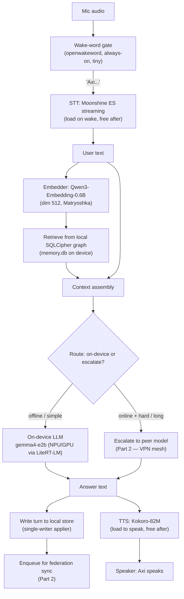
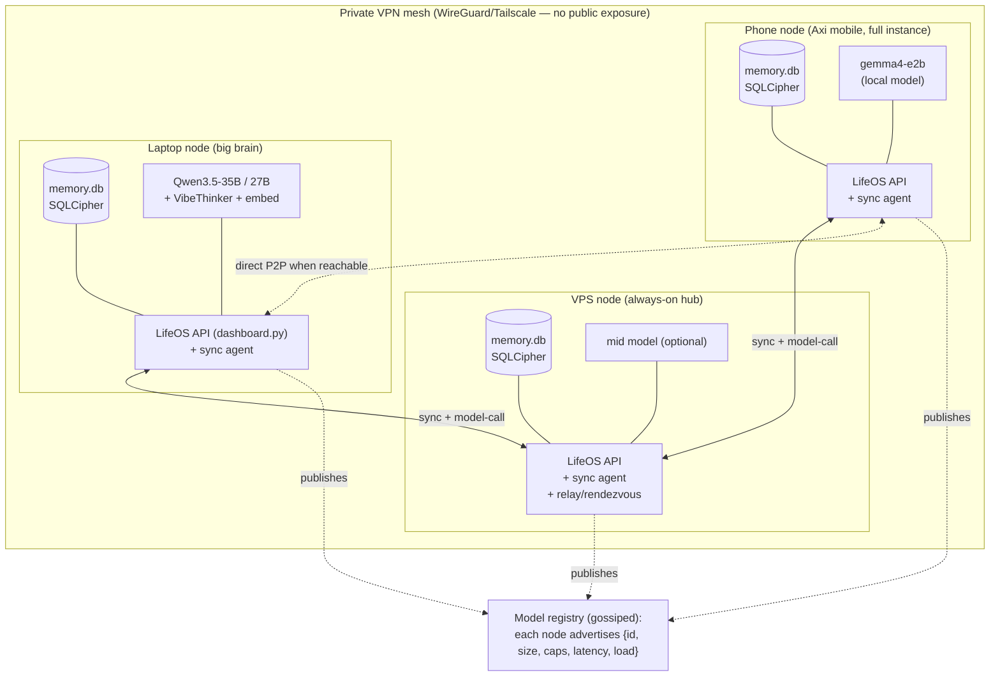

# PRD — On-Device-First Axi + LifeOS Federation Mesh

Status: design / roadmap (no code, no downloads, no services). Date: 2026-07-19.
Owner: Héctor. Scope: strategic roadmap for the next major LifeOS/Axi arc.
Companion doc: `axi/docs/prd/embedding-model-investigation.md` (embed-slot pick).

> Naming caveat up front: the brief calls the sync milestone **"M4 sync."** The
> current repo does **not** use that name. The only forward-looking sync design
> that exists in code is referenced as **"M3 sync / design D9"** — a *planned*
> sealed-box `K_sync` transport that captures a `device_pubkey` at pairing but
> does nothing with it yet (`axi/src/axi/api_v1.py:88-92`,
> `mobile/lib/features/connection/data/pairing_repository.dart:9-10`). This PRD
> standardizes on **"D9 sync"** for the sealed-box transport and treats
> federation as a superset built on top of it. If we keep the "M4" label, we
> should rename the code references so there is one consistent name.

---

## 1. Summary, Goals, Non-Goals

### 1.1 Summary

LifeOS today is a **local-first, single-machine** system: an encrypted SQLCipher
graph store (`memory.db`) on the laptop, a FastAPI server (`dashboard.py`, 180+
routes), and a primary brain **Qwen3.5-4B on port 8080**. The mobile app
(`mobile/`, Flutter) is a **thin client** that pushes mutations to the laptop
over HTTP through a durable, one-directional **outbox** (client → server, FIFO,
last-writer-wins at the server, no merge). Lose the laptop's Wi-Fi and Axi goes
dark.

This roadmap changes that in two decided tiers:

1. **On-device first-hand (mandatory baseline).** The phone runs *everything*
   itself, fully offline: a primary LLM that "handles everything," a text
   embedding model for retrieval, speech-to-text, and text-to-speech (Axi
   speaks). Zero dependency on the laptop for the core loop.

2. **Federation mesh (optional escalation).** Every device — phone, VPS,
   dedicated server, laptop, PC, Mac — runs its **own full LifeOS instance**.
   Nodes link over the **already-configured VPN** (VPS + laptop + phone) to
   (a) talk device-to-device, (b) **sync each other's data** toward eventual
   consistency, and (c) **advertise their local models** so any device can pick
   which model to use — its own on-device model, or a bigger model on any online
   node. UX = a **model picker** on each device listing `{local model} + {models
   advertised by online peers}`.

Tier 1 is a product commitment; Tier 2 is where the genuinely hard engineering
lives (multi-master eventual consistency over a store that was explicitly built
single-writer, single-machine, with autoincrement integer IDs and no
version/tombstone metadata). This doc is honest about that.

### 1.2 Goals

- **G1 — Offline-complete phone.** The phone completes the full Axi loop
  (listen → understand → retrieve from local memory → answer → speak) with the
  network off. No laptop, no cloud.
- **G2 — Spanish-first quality.** Rioplatense/neutral Spanish for STT, retrieval,
  generation, and TTS. Spanish is the primary axis, not an afterthought.
- **G3 — Every device is a peer.** Any device can run a full LifeOS instance;
  none is privileged as "the server" by architecture (though some are bigger).
- **G4 — Choose any model in the mesh.** A device can route a request to its own
  model or to a peer's advertised model, transparently, over the VPN.
- **G5 — Data converges.** A record created on any node eventually appears,
  correctly, on every node, with a defined conflict policy — never silent data
  loss.
- **G6 — Private by construction.** No public exposure; the mesh lives on the
  VPN. Encryption at rest per node; authenticated peers only.
- **G7 — Demo-able in slices.** Each milestone is small enough to show on a
  build-in-public stream.

### 1.3 Non-Goals

- **NG1 — No public cloud service.** The mesh is private (VPN only). We are not
  building a hosted multi-tenant product. (Consistent with
  `axi/docs/threat-model.md:18-19` "no cloud" posture — federation *relaxes*
  "single-machine," it does not introduce a public cloud.)
- **NG2 — No real-time collaborative editing.** We want personal-data
  convergence across a handful of the *owner's own* devices, not Google-Docs
  multi-user concurrency. This narrows the CRDT problem massively.
- **NG3 — No training/fine-tuning on device.** Inference only on the phone.
- **NG4 — No strong consistency / distributed transactions.** Eventual
  consistency is the explicit target; we will not build consensus (Raft/Paxos).
- **NG5 — Not replacing the laptop brain.** The 35B/27B big brains stay on
  capable nodes; the phone's on-device model is a capable *baseline*, and the
  mesh lets the phone *reach* the big brain when online — it does not require
  shrinking the big brain.
- **NG6 — No new identity provider.** Auth stays device-scoped bearer tokens +
  keys, extended for peers; no SSO/account system.

---

## Part 1 — On-Device Stack

The phone must run four models plus glue, co-loaded or hot-swappable, inside a
mobile RAM budget. This section picks each component, its runtime, and a
fallback, then states the hard constraints.

### 1.1 Reality check: the 2026 mobile envelope

- Flagship NPUs in 2026 are ~35–45 TOPS (Apple A18/A19 ≈ 35 TOPS; Snapdragon 8
  Elite ≈ 45 TOPS). But **RAM, not TOPS, is the binding constraint.** An 8 GB
  iPhone realistically leaves **3–4 GB** for model weights after the OS; that
  caps the LLM at **≤ 3B params at Q4**, and that budget is *shared* with the
  embedder, STT, and TTS if any are co-resident.
- The framework landscape has consolidated: **ExecuTorch** (Meta, 1.0 GA Oct
  2025 / v1.1 Jan 2026; 50 KB runtime, 12+ backends incl. Core ML, Qualcomm
  QNN/Hexagon, XNNPACK+KleidiAI, MediaTek, Exynos, Vulkan) for production mobile;
  **Google AI Edge / LiteRT-LM / MediaPipe LLM** (Gemma 3n E2B/E4B, `.task` /
  `.litertlm`, GPU + NPU delegates); **llama.cpp** for prototyping/parity with
  our desktop stack; and vendor stacks (Apple Foundation Models on iOS 26+, an
  ~3B on-device model — later AFM3 a 20B sparse model activating 1–4B/prompt).
- **Flutter integration**: `flutter_gemma` is the pragmatic path — one package,
  Android/iOS/desktop, supports Gemma 4 E2B/E4B, Gemma 3n, **Qwen3 0.6B**,
  embeddings, RAG, function-calling, and vision via MediaPipe/LiteRT-LM under the
  hood. Alternative: our own FFI/platform-channel bridge to ExecuTorch or
  llama.cpp for maximum control and desktop parity.

### 1.2 Component picks

#### LLM (the "handles everything" brain)

| Candidate | Size (Q4) | Runtime | Spanish | Vision | Notes |
|---|---|---|---|---|---|
| **gemma4-e2b-it** *(pick)* | ~1.4–2.0 GB | flutter_gemma (LiteRT-LM `.task`/`.litertlm`), NPU/GPU | Good (multilingual Gemma) | ✅ | Already vetted in our 16-model audit (~0.785 quality); already downloaded (`~/LifeOS/models/gemma4-e2b-it/`). "E2B" = effective-2B (3n architecture), memory-efficient. Best size/quality/vision balance. |
| **qwen35-2b** *(alt)* | ~1.3–1.6 GB | llama.cpp mobile / ExecuTorch / flutter_gemma | Strong (Qwen multilingual) | text | Already local (`~/LifeOS/models/qwen35-2b/`). Same family as desktop 4B brain → prompt/behaviour parity. No vision at 2B. |
| Qwen3 0.6B | ~0.5 GB | flutter_gemma | OK | text | Emergency low-RAM fallback / older phones. Weak for "handles everything." |
| Apple Foundation Models (~3B) | 0 (OS-provided) | Foundation Models framework (iOS 26+) | Good | ✅ (2026 image input) | **iOS-only**, no download, no RAM cost to us, free. Great *fallback/augment* on newer iPhones; not portable to Android. |
| gemma4-e4b-it | ~2.6–3.2 GB | flutter_gemma | Good | ✅ | Only on 12 GB+ phones; too heavy to co-load with STT/TTS on 8 GB. |

**Recommendation: `gemma4-e2b-it` as the default on-device brain**, via
`flutter_gemma` / LiteRT-LM with GPU/NPU delegate. Rationale: it is the only 2B
candidate that also gives **vision** (needed for Axi's screen/photo co-pilot),
it is already audited and downloaded, and LiteRT-LM gives us NPU offload on
Android and Core ML/GPU on iOS.
**Fallback ladder:** `qwen35-2b` where vision isn't needed or where family-parity
with the desktop brain matters → **Apple Foundation Models** on capable iPhones
(free, zero-RAM) → `Qwen3 0.6B` on RAM-starved devices.
**Spanish tradeoff (be honest):** the 2B tier is *noticeably* weaker in Spanish
reasoning than the desktop 27B/35B brains. It is good enough for the offline
baseline loop (capture, recall, short answers, commands) but not for the
long-form, nuanced Spanish the big brain produces. This is *the* argument for the
federation escalation: keep the offline baseline honest about its ceiling, and
let the phone reach the big brain over the VPN when online.

#### Embedding (semantic memory / RAG)

**Pick: Qwen3-Embedding-0.6B** — already the top pick in
`embedding-model-investigation.md`: tiny, multilingual/Spanish-strong,
CPU-friendly, Matryoshka truncatable to **512**, `pooling: last`. On device it
runs via `flutter_gemma` embeddings or an ExecuTorch/llama.cpp embed path.
**Fallback:** GTE-multilingual-base (305M) or Arctic-embed-m-v2.0 (305M) if we
need to shave RAM further; both MRL, both multilingual. Keep the **same
embedder** as the mesh/laptop so vectors are comparable when data syncs (see
Part 2 — cross-node embedding compatibility is a real constraint: two nodes must
agree on model + dim + pooling or their vector spaces don't match).

#### STT (speech-to-text, Axi listens)

| Candidate | Size | Latency | Spanish | Notes |
|---|---|---|---|---|
| **Moonshine (Spanish model)** *(pick)* | 26–245 MB | Real-time streaming | ✅ dedicated ES model | Built for on-device; streaming encoder caches state → transcribes *while* you talk. Ideal for wake-word → command. |
| whisper.cpp (tiny/base) *(fallback)* | 75–150 MB | Near-real-time | ✅ multilingual | Battle-tested, ported to iOS/Android/RPi via GGML; matches our desktop whisper posture. Base is more accurate, slower. |
| Native OS STT | 0 | Real-time | ✅ | `SFSpeechRecognizer` (iOS) / Android `SpeechRecognizer`. Zero cost but inconsistent offline guarantees and privacy posture varies. Use only as opportunistic fast-path. |

**Recommendation: Moonshine ES for the live wake-word/command path**, whisper.cpp
base as the accuracy fallback and for batch transcription (e.g. meeting audio).
Ties into the existing wake-word work (`openwakeword` is already local) — the
wake-word detector gates the streaming STT so we're not always decoding.

#### TTS (text-to-speech, Axi speaks)

| Candidate | Size | Spanish voices | Notes |
|---|---|---|---|
| **Kokoro-82M** *(pick)* | ~80–350 MB (ONNX + voices) | ✅ multilingual voices | Quality/size sweet spot; already local (`~/LifeOS/models/kokoro/`). ONNX runs on-device via ORT mobile. |
| Piper *(fallback)* | ~20–60 MB/voice | ✅ 100+ voices incl. ES | Lighter, lower quality; great for RAM-tight devices. Already local (`~/LifeOS/models/piper-voices/`). |
| Native OS TTS | 0 | ✅ | `AVSpeechSynthesizer` / Android TTS. Zero cost, robotic. Emergency fallback. |

**Recommendation: Kokoro-82M for Axi's voice**, Piper for low-RAM devices,
native OS TTS as the always-available floor.

### 1.3 Hard constraints

**RAM budget (co-loaded worst case, 8 GB phone, ~3.5 GB app-usable).** The
naïve "keep all four hot" plan does **not** fit:

| Component | Resident (Q4/quant) |
|---|---|
| LLM gemma4-e2b | ~1.6 GB |
| Embedder Qwen3-0.6B | ~0.5 GB |
| STT Moonshine (streaming) | ~0.15 GB |
| TTS Kokoro-82M | ~0.2 GB |
| KV cache + app + Flutter engine | ~0.6–1.0 GB |
| **Total co-resident** | **~3.0–3.5 GB → at/over budget** |

**Mitigation — orchestrated load, not all-hot.** Only the LLM stays hot. STT and
TTS are **loaded around a turn** (load STT on wake-word, free after transcript;
load TTS to speak, free after). The embedder is loaded on retrieval and can be
CPU-side. On 12 GB+ phones we can keep more hot. This is a scheduler in the
mobile app, not a modeling problem.

**Battery / thermal.** Sustained NPU/GPU decode heats the phone and drains
battery fast. Rules: prefer NPU delegate (LiteRT-LM) over GPU where available;
cap generation length on device; use streaming STT (compute amortized while the
user speaks); never keep the LLM decoding in the background; expose a
"performance vs battery" toggle. Long/complex asks are exactly what should
*escalate to a peer* (Part 2) rather than cook the phone.

**App size / download-on-first-run.** Do **not** ship models in the app binary
(store limits + update churn). Ship a thin app; on first run, download the model
bundle (LLM + embedder + STT + TTS ≈ **2.5–3.5 GB**) over Wi-Fi with resumable
download, checksum verification, and a model-manager UI (pick tier per device:
"lite" = Qwen3-0.6B + Piper, "standard" = gemma4-e2b + Kokoro + Moonshine). This
mirrors the desktop `config/active_*_model.json` swap-by-config pattern.

**iOS vs Android differences.**

| Axis | iOS | Android |
|---|---|---|
| Best accel path | Core ML (ExecuTorch) / Metal GPU; **Apple Foundation Models** free ~3B on iOS 26+ | Qualcomm Hexagon/QNN NPU, LiteRT-LM NPU delegate, Vulkan GPU |
| RAM headroom | Tight, aggressive jetsam kills background models | More variable; more true multitasking headroom on high-end |
| Format | `.task`/`.litertlm` (MediaPipe), Core ML, GGUF | `.task`/`.litertlm`, GGUF, QNN |
| Gotcha | Background execution limits → can't decode when app not foreground | Fragmentation: NPU delegates vary by SoC; must feature-detect |
| Free lunch | Foundation Models = zero-RAM, zero-download brain (iOS-only) | No universal equivalent; must ship our own weights |

**Design consequence:** abstract the on-device LLM behind an `LlmEngine`
interface with backends `{flutter_gemma/LiteRT-LM, appleFoundationModels,
llamaCppFfi}`; select at runtime by platform + capability probe. Same for
STT/TTS.

### 1.4 On-device pipeline diagram



The key new idea vs today's thin client: the **entire loop closes on the device**
(offline branch), and the store write goes to a **local** SQLCipher graph — the
phone becomes a *full node*, not a client. When online, the router may escalate
the generation to a peer, and every local write is also enqueued for mesh sync.

---

## Part 2 — Federation Mesh

Every device runs a **full LifeOS instance** (its own `memory.db`, its own API,
its own model). Nodes discover and authenticate each other over the VPN, sync
data toward eventual consistency, and advertise models for cross-node inference.

### 2.1 Architecture overview



Roles are soft: the **VPS** is a natural **always-on rendezvous/relay** (helps
NAT'd peers find each other and buffers sync for offline nodes), the **laptop**
is the **big-model** node, the **phone** is the **mobile full node**. But every
node speaks the same protocol; there is no hard master.

### 2.2 Transport, discovery, and auth

- **Transport (now): the existing VPN.** VPS + laptop + phone are already on a
  private WireGuard-based mesh (Tailscale-style). Nodes get stable mesh IPs; no
  ports face the public internet. This is the pragmatic choice and matches
  today's "no public exposure" threat model. Future option: libp2p for
  transport-agnostic P2P, but not now.
- **Discovery.** Two tiers: (1) a small **static/peer-list** seeded from the
  always-on VPS (each node knows the VPS mesh address; the VPS returns the
  current member list + advertised models — a gossip seed); (2) optional
  **MagicDNS / mesh-DNS** names per node. Avoid relying on mDNS multicast (patchy
  over WireGuard). The VPS acts as the rendezvous so a freshly-woken phone can
  find who's online without broadcast.
- **Node authentication (this is new and load-bearing).** Today auth is a
  per-**device** bearer token hashed in the `devices` table
  (`store.py:2602-2615`) and a reserved `device_pubkey`. Extend this into
  **mutual peer auth**: each node has a long-lived **node keypair**; nodes
  exchange and pin public keys during a **pairing** step (reuse the existing QR
  pairing flow `axi/src/axi/pairing.py` / `POST /api/v1/pair`, promoted from
  "phone pairs to laptop" to "node pairs to node"). All peer API calls carry a
  signed token; the VPN gives transport encryption, the node keypair gives
  *identity* (VPN membership alone is not identity — a stolen device is still on
  the VPN). This closes the gap `threat-model.md:41-43` flags (compromised live
  peer).

### 2.3 Model advertisement + remote-inference protocol

Two clean sub-protocols over the authenticated peer channel:

**(a) Model advertisement (gossip).** Each node periodically publishes a signed
**model card list**:

```jsonc
// GET /api/v1/models  (per node)  -> also gossiped to the VPS registry
[
  { "node": "laptop", "id": "qwen3.6-35b-a3b", "family": "qwen",
    "caps": ["chat","tools","vision"], "ctx": 32768,
    "quality": 0.91, "est_latency_ms_per_tok": 18, "load": 0.2, "online": true },
  { "node": "phone",  "id": "gemma4-e2b", "caps": ["chat","vision"],
    "quality": 0.785, "est_latency_ms_per_tok": 60, "load": 0.0, "online": true }
]
```

The registry is **eventually-consistent, best-effort** (stale entries are fine —
worst case a call is refused and the picker falls back). This is *not* the data
sync path; it is cheap gossip with TTLs.

**(b) Remote inference.** A node calls a peer's model with the **same shape as the
local brain call** (`ask_with_tools` today routes to `127.0.0.1:8080`,
`axi/src/axi/brain.py`). Generalize the brain client to an `InferenceTarget =
{local | peer(nodeId, modelId)}`. A peer request is a signed
`POST /api/v1/infer` streaming SSE tokens back. Critical rule: **remote inference
is context-in / tokens-out only** — the requesting node assembles the prompt
(including any retrieved private context) and the serving node **does not
persist** it (stateless, `no-store`), so escalating a hard Spanish question to
the laptop's 35B does not scatter your data across nodes beyond the sync layer's
control.

**(c) The cross-node model picker (UX).** Each device shows a picker:
`{ local model } + { models advertised by online peers }`, annotated with
size/quality/latency/online-state. Selection modes:
- **Manual**: user pins a model ("always use laptop-35B when online").
- **Auto (recommended default)**: the router (see Part 1 diagram `ROUTE` node)
  picks local when offline or for simple/short/low-latency asks, and escalates to
  the best online peer for hard/long/high-quality Spanish asks — subject to
  battery and reachability. Manual pin always wins.

### 2.4 Data sync — the crux (multi-master eventual consistency)

This is the hard part, and the current store actively fights it. **Grounding
facts** (from `store.py`, `write_router.py`, mobile outbox):

- `memory.db` = SQLCipher graph (`nodes` + `edges`) + per-domain tables
  (`conversations`, `meetings`, `reminders`, …) + FTS5.
- **Row IDs are `INTEGER PRIMARY KEY AUTOINCREMENT`** — *local, sequential, not
  globally unique*. Two nodes both mint `id=42` for different records. **This is
  the single biggest obstacle to multi-master merge.**
- **No version column, no vector clock, no origin/`updated_by` column, no
  tombstones.** Deletes are **hard** (`ON DELETE CASCADE`). There is *nothing*
  today to drive LWW or CRDT convergence, and hard deletes can't be replicated
  as events.
- Timestamps are `REAL` Unix-epoch (`created_at`/`updated_at`/`ts`), plus
  `created_tz` on nodes — usable as an LWW clock, but wall-clock skew across
  nodes is a real hazard.
- Writes are already funneled through a **single-writer daemon** over an AF_UNIX
  socket (`write_router.py`) — *intra-machine* serialization. This is the
  **natural hook**: a federation applier becomes just another write op on the
  same chokepoint, so we never fight SQLCipher concurrency.
- The mobile "sync" is a **one-directional outbox** replaying raw HTTP mutations
  (`sync_service.dart`, `outbox.dart`) — effectively **LWW at the server, no
  merge**. It is an offline-write queue, not replication. It stays useful (see
  phasing) but is not the federation engine.

#### 2.4.1 Options analyzed

**Option A — Off-the-shelf CRDT SQLite (cr-sqlite / sqlite-sync).**
cr-sqlite adds multi-master replication to SQLite via column-level CRDTs (LWW /
fractional-index / counter) plus a causally-ordered changeset log; sqlite-sync
(sqliteai) is a similar CRDT extension. Runs on mobile + server.
- *Pros:* solves convergence for us; mature in 2026; per-column LWW is exactly
  right for "personal data edited on one device at a time."
- *Cons:* **it is a SQLite *extension* and needs to run inside SQLCipher** — we'd
  need cr-sqlite compiled against SQLCipher (non-trivial, must verify), on
  *every* platform including iOS/Android via FFI. It also rewrites schema
  semantics (CRDT-ifying tables) and wants **stable primary keys** — which forces
  the ID migration anyway. Graph `edges` referencing autoincrement `from_id/to_id`
  break under merge until IDs are global. **High integration risk with SQLCipher;
  must prototype before betting on it.**

**Option B — Per-node append-only event log + deterministic merge (recommended).**
Make each node's mutations an **append-only, signed, per-node oplog** (an
`events` store already exists separately — `store.py:964+`, its own SQLCipher
file/key — perfect substrate). Each event = `{event_id (uuid), node_id, lamport,
wall_ts, op, entity_uuid, payload}`. Sync = nodes exchange events they haven't
seen (anti-entropy: "give me everything after your last-seen vector per node");
each node **replays** foreign events through its **single-writer applier** into
its own `memory.db`. Convergence is guaranteed because every node applies the
same set of events under the same deterministic merge rule.
- *Pros:* fits the architecture *exactly* — the applier is the existing
  single-writer daemon; the event store already exists; no SQLCipher-extension
  gamble; transport-agnostic (works over VPN today, anything later); the log
  doubles as audit/history and makes **soft deletes/tombstones** natural
  (delete = an event, not a `DROP`). We own the conflict policy.
- *Cons:* we build the merge/anti-entropy ourselves; we must define per-entity
  merge (below); log growth needs compaction/snapshots.
- *Merge rule (per entity, keyed by `entity_uuid`):* **per-field LWW** using
  `(lamport, node_id)` as the tiebreaker (Lamport clock avoids wall-skew
  ordering bugs; `node_id` breaks ties deterministically). Wall-clock kept only
  for human display. This is effectively a hand-rolled LWW-map CRDT — but scoped
  to *our* entities, over *our* applier, without a foreign SQLite extension.

**Option C — Last-writer-wins, whole-row, over a pull/push protocol.**
Simplest: add `uuid` + `updated_at` + `origin_node` to every table, bidirectional
sync compares `updated_at`, newest row wins wholesale.
- *Pros:* least code; comprehensible.
- *Cons:* **whole-row LWW loses concurrent edits to different fields** of the same
  record (edit meeting title on phone, notes on laptop → one clobbers the other);
  hard deletes still unreplicable without tombstones; wall-clock skew directly
  corrupts ordering. Fine for a v0 with one active device at a time; dangerous as
  the mesh grows.

#### 2.4.2 Recommendation

**Adopt Option B (per-node signed event log + deterministic per-field LWW merge
via the existing single-writer applier), and prototype Option A (cr-sqlite) in
parallel as a possible accelerator** for the pure-relational tables only. Reasons:
B is the lowest-architectural-friction path given (i) the single-writer daemon is
already the perfect apply chokepoint, (ii) a separate events SQLCipher store
already exists, (iii) it avoids betting the roadmap on cr-sqlite-inside-SQLCipher
working on iOS. Option C is acceptable **only** as the throwaway v0 while B is
built.

#### 2.4.3 Prerequisite migrations (unavoidable, do these first)

Whatever option wins, the store must gain federation-ready metadata. This is a
**breaking schema migration** and should be the very first federation slice:

1. **Global IDs.** Add a stable `uuid TEXT` to `nodes`, `edges`, and every synced
   domain table (keep the local autoincrement `id` for FK/perf, but make `uuid`
   the sync identity). Edges must reference peer rows by **`uuid`**, not local
   int. Backfill existing rows with generated UUIDs. *This is the migration that
   unblocks everything.*
2. **Per-row sync metadata.** Add `updated_at` (already present on `nodes`),
   `origin_node TEXT`, and a `version`/`lamport INTEGER` per synced row.
3. **Tombstones / soft delete.** Replace hard `ON DELETE CASCADE` on synced
   entities with `deleted_at REAL` tombstones so deletes replicate. Keep a GC
   pass that hard-prunes tombstones older than the slowest node's sync horizon.
4. **Event log schema** (`events` store): `event_id`, `node_id`, `lamport`,
   `wall_ts`, `op`, `entity_uuid`, `payload_json`, `sig`.

#### 2.4.4 Per-node encryption key handling

Today each node has an independent random 32-byte SQLCipher key
(`~/.local/state/axi/memory.key`, `chmod 600`, **no passphrase, no rotation, not
per-device** — `threat-model.md:24-54`). For federation:

- **At-rest keys stay per-node and independent.** Node A's `memory.db` key never
  leaves Node A. Sync moves *plaintext events over an authenticated, encrypted
  channel* (VPN + node-keypair), each node re-encrypting into its own store. We
  do **not** try to share one DB key across devices (that would make a single key
  leak catastrophic and forces rotation coordination).
- **Transport key = the sealed-box `K_sync` already reserved (D9).** The
  `device_pubkey` captured at pairing (`api_v1.py:88-92`) becomes the peer's
  box public key; events are sealed to the receiving node's key. This is the
  intended, already-scaffolded hook — we finally *use* it.
- **New requirement: a root of trust for the mesh.** Introduce an optional
  **owner passphrase** (argon2-derived — already on the threat-model future-work
  list, line 74-77) that gates *joining* the mesh and signs node-key enrollment,
  so an attacker who lands on the VPN still can't enroll a rogue node. Per-store
  at-rest keys can remain passphrase-independent for now; the passphrase governs
  *federation membership*, not disk encryption, in v1.

#### 2.4.5 Honest difficulty statement

Multi-master sync over this store is a **months-of-work, correctness-critical**
subsystem, not a slice. The dangerous parts, ranked:
1. **The UUID migration** touching `nodes`/`edges`/every domain table + FK
   rewrites — irreversible, must be perfect, must run identically on laptop and
   phone.
2. **Graph edges under merge** — an edge can arrive before its endpoints; the
   applier needs deferred/again-later handling and referential-integrity
   tolerance.
3. **Tombstone/GC correctness** — prune too early and a slow phone resurrects
   deleted data (classic "zombie" bug).
4. **Clock discipline** — Lamport clocks for ordering, wall-clock only for
   display; never order by wall-clock.
5. **cr-sqlite-inside-SQLCipher on iOS** *if* we go Option A — unproven here,
   must spike first.
Mitigation is phasing (below): ship the *offline phone* fully before touching
sync, then sync **read-only mirror first**, then one-active-writer LWW, then true
multi-master.

### 2.5 Where the current pieces map

| Today | Federation role |
|---|---|
| `write_router.py` single-writer daemon (AF_UNIX) | The **apply chokepoint** — foreign events replay here as local write ops. |
| separate `events` SQLCipher store (`store.py:964+`) | The **per-node oplog** substrate. |
| `devices` table + `device_pubkey` (`store.py:2602`) | Promoted to **peer/node registry + sealed-box key**. |
| QR pairing (`pairing.py`, `POST /api/v1/pair`, D6) | Promoted to **node-to-node pairing**. |
| `/api/v1/capabilities` (D4) | Extended into **model advertisement**. |
| mobile outbox (`sync_service.dart`) | Stays as the **offline-write queue**; superseded as *the* sync engine by the event log, but still buffers phone writes when the local applier is the only reachable node. |
| `ask_with_tools` → `127.0.0.1:8080` (`brain.py`) | Generalized to `InferenceTarget{local|peer}` for **remote inference**. |
| `identity.py` single user-hub `person` node | Stays the graph center; must get a `uuid` and merge cleanly (one owner across all nodes → low conflict). |

---

## 3. Phasing / Slices (ordered, demo-able)

**Principle: on-device usable offline FIRST, federation second.** Each slice is a
streamable demo.

### Phase 0 — Foundations (enable the phone to be a full node)
- **S0.1** `LlmEngine`/`SttEngine`/`TtsEngine`/`EmbedEngine` interfaces in the
  Flutter app + capability probe (platform, RAM, NPU). *Demo: app reports "this
  device can run: gemma4-e2b (NPU)".*
- **S0.2** Model-manager UI + resumable download-on-first-run + checksum. *Demo:
  pick "standard" tier, watch it fetch 3 GB, verify.*
- **S0.3** Embed the SQLCipher graph store **on the phone** (port the store schema
  to a mobile SQLCipher; the phone gets its own `memory.db`). *Demo: create a
  record offline on the phone, see it persist locally.*

### Phase 1 — Offline-complete phone (Tier 1 done)
- **S1.1** On-device LLM answering from typed input via `flutter_gemma`. *Demo:
  airplane mode, ask Axi a question, get an answer.*
- **S1.2** On-device embedder + local RAG retrieval from the phone store. *Demo:
  offline "¿qué anoté sobre X?" pulls the right local record.*
- **S1.3** On-device STT (Moonshine) wired to the existing wake-word. *Demo:
  "Axi..." → transcribes offline.*
- **S1.4** On-device TTS (Kokoro) — **Axi speaks**. *Demo: full offline voice
  loop, mic → answer → spoken, plane mode.* **← Tier-1 milestone / big stream.**
- **S1.5** On-device router stub (`ROUTE` always-local for now) + battery/perf
  toggle.

### Phase 2 — Federation groundwork (no user-visible sync yet)
- **S2.1** **Schema migration**: `uuid` + `origin_node` + `lamport` +
  `deleted_at` on `nodes`/`edges`/domain tables; edges keyed by uuid; backfill.
  Run on laptop **and** phone stores. *Demo: show every row now has a stable UUID
  identical after export/import.*
- **S2.2** Event log store + emit an event on every write (via the single-writer
  applier). *Demo: create records, show the append-only signed oplog.*
- **S2.3** Node identity keypair + promote pairing to node-to-node over the VPN +
  peer auth. *Demo: laptop and phone mutually pair and authenticate over the
  VPN.*

### Phase 3 — Model federation (the picker) — *high demo value, lower risk than data sync*
- **S3.1** `GET /api/v1/models` advertisement + gossip via the VPS registry.
  *Demo: phone lists the laptop's 35B as available.*
- **S3.2** `POST /api/v1/infer` streaming remote inference (stateless, no-store) +
  generalize the brain client to `InferenceTarget`. *Demo: phone asks a hard
  Spanish question, watch it stream from the laptop 35B over the VPN.*
- **S3.3** Cross-node **model picker UI** + auto-router (local-offline /
  peer-online). *Demo: toggle the picker, same question answered by e2b vs 35B.*

### Phase 4 — Data sync (the crux, staged by risk)
- **S4.1** **Read-only mirror**: one node (VPS) pulls-and-replays another node's
  event log into a *read-only* copy. One-directional, no conflicts. *Demo: create
  on laptop, appears on VPS.*
- **S4.2** **Bidirectional, one-active-writer LWW**: anti-entropy exchange +
  per-field LWW merge, but assume one device edits a given entity at a time.
  *Demo: create on phone offline, sync to laptop when back online, and vice
  versa.*
- **S4.3** **True multi-master merge**: concurrent edits to different fields
  converge; tombstone GC; edge-before-endpoint handling; Lamport ordering.
  *Demo: edit the same meeting on two offline devices, reconnect, converge with
  no loss.* **← the hard milestone.**
- **S4.4** cr-sqlite spike (parallel, optional) evaluated as a possible
  replacement for hand-rolled merge on relational tables.

### Phase 5 — Hardening
- Owner passphrase (argon2) gating mesh enrollment; sealed-box `K_sync` in use;
  tombstone GC horizons; log compaction/snapshots; conflict-inspection UI ("these
  two edits collided, we kept X"); embedder-version compatibility guard across
  nodes.

---

## 4. Open Design Decisions (need Héctor's input)

1. **Sync engine: build (Option B event-log) vs adopt (Option A cr-sqlite).**
   Recommendation is B with an A spike. This is the highest-leverage fork — it
   sets months of work. *Decision needed before Phase 4.*
2. **Default on-device LLM: `gemma4-e2b` (vision, audited) vs `qwen35-2b`
   (desktop-family parity, no vision).** Recommendation e2b. Affects the whole
   mobile UX (vision co-pilot on device or not).
3. **Mesh root-of-trust: introduce an owner passphrase now, or rely on
   VPN-membership + node keys alone for v1?** Recommendation: node keys for
   Phase 2–3, passphrase-gated enrollment before real data sync (Phase 4/5).
4. **iOS: lean on Apple Foundation Models (free ~3B, zero-RAM) as the iPhone
   default, or ship our own weights everywhere for cross-platform parity?**
   Tradeoff: consistency + Spanish control vs zero download/RAM on iOS.
5. **Naming: "M4 sync" (brief) vs "M3/D9" (code).** Pick one; rename the other.
6. **Sync scope: sync *everything* (full graph + all domains) or start with a
   whitelist (records/notes/reminders) and exclude high-churn/large data
   (attachments, raw meeting audio) behind a separate blob-sync?** Recommendation:
   whitelist first; blobs via content-addressed lazy fetch, not the event log.

---

## 5. Risks + Mitigations

| # | Risk | Severity | Mitigation |
|---|---|---|---|
| R1 | UUID migration corrupts or diverges between laptop/phone stores | **Critical** | Deterministic migration script, dry-run + verify export/import equality, full backup snapshot first (existing local-snapshot backup), run on a copy before prod. Phase 2 gate. |
| R2 | Multi-master merge loses/zombies data (tombstone GC, clock skew) | **Critical** | Lamport clocks (not wall-clock) for ordering; conservative GC horizon = slowest node; conflict-inspection UI; stage S4.1→S4.2→S4.3 so multi-writer is last. |
| R3 | 4 models don't co-fit 8 GB phone RAM | High | Orchestrated load (only LLM hot; STT/TTS around-the-turn); "lite" tier; escalate heavy asks to peers. Section 1.3. |
| R4 | 2B Spanish quality disappoints for long-form | High | Set expectations (baseline vs big-brain); auto-escalate hard Spanish to peer 27B/35B when online; Spanish eval before shipping the tier (mirror embed Slice-0 eval). |
| R5 | cr-sqlite doesn't build against SQLCipher on iOS | Medium | Don't depend on it — Option B is SQLCipher-native; cr-sqlite is a *parallel spike*, not the critical path. |
| R6 | VPN membership mistaken for identity → rogue node syncs/reads data | High | Node keypairs + pinned pubkeys + (Phase 5) passphrase-gated enrollment; VPN is transport, not auth. |
| R7 | Battery/thermal from sustained on-device decode | Medium | NPU delegate, generation caps, no background decode, perf/battery toggle, escalate long gens to peers. |
| R8 | Embedder mismatch across nodes → incomparable vectors after sync | Medium | Pin `{model,dim,pooling}` mesh-wide; store embedder version per node; re-embed on mismatch; compatibility guard (Phase 5). |
| R9 | App-store size / update churn from bundled models | Medium | Ship thin app, download-on-first-run, resumable + checksummed, model-manager UI. |
| R10 | Sync protocol grows unbounded log | Medium | Snapshots + compaction; per-node last-seen vectors; tombstone GC. |
| R11 | Offline outbox (client→server LWW) coexisting with event-log sync causes double-apply | Medium | Make outbox writes emit events idempotently (event_id dedupe); retire outbox-as-sync once phone is a full node, keep it only as local write buffer. |
| R12 | iOS background limits kill on-device models mid-turn | Medium | Foreground-only decode; checkpoint partial turns; resume on foreground; prefer Foundation Models on iOS where it survives jetsam better. |
| R13 | Membership cert revocation (follow-up): a compromised/decommissioned node keeps mesh (incl. remote-inference `/api/v1/infer`) access until its cert EXPIRES — there is no revocation list yet | Medium | Partial stopgap shipped: cert TTL cut from 1 year to 90 days so a leaked node key self-heals sooner (`mesh_trust._DEFAULT_TTL_SECONDS`). Full fix (signed revocation list and/or short-lived certs + renewal) is a pending follow-up; hook point marked at `mesh_trust.verify_membership` expiry check. |

---

## 6. Appendix — Grounding references (current tree)

- Store / schema / keys: `axi/src/axi/store.py` (nodes/edges DDL ~198-237;
  `devices` ~2602-2615; key handling 412-434; separate events store 964+).
- Single-writer: `axi/src/axi/write_router.py` (AF_UNIX socket 41-48; dispatch
  175-305; opt-in `single_writer` default off).
- Brain: `axi/src/axi/brain.py` (Qwen3.5-4B @ 8080; VibeThinker @ 8082;
  `ask_with_tools`).
- API: `axi/src/axi/dashboard.py` (FastAPI app, 180+ routes);
  `axi/src/axi/api_v1.py` (`/api/v1/capabilities` D4, `/api/v1/pair` D6;
  `device_pubkey` reserved for D9 K_sync, 88-92); `axi/src/axi/pairing.py`.
- Mobile sync: `mobile/lib/core/outbox/outbox.dart`,
  `mobile/lib/core/outbox/sync_service.dart` (one-directional, FIFO, LWW at
  server); pairing `mobile/lib/features/connection/data/pairing_repository.dart`.
- Threat model / keys: `axi/docs/threat-model.md` (single random per-store key,
  no passphrase 24-54; future argon2 74-77; "no cloud" 18-19).
- Non-goal history: `axi/docs/PRD-life-companion-v1.md:220,352-353`,
  `axi/docs/PRD-NEXT.md:26` (cloud sync as prior non-goal — federation is
  private-mesh, not cloud).
- Embed pick: `axi/docs/prd/embedding-model-investigation.md`
  (Qwen3-Embedding-0.6B).
- Local models already present: `~/LifeOS/models/{gemma4-e2b-it, qwen35-2b,
  qwen3-embedding-4b, kokoro, piper-voices, openwakeword}`.
